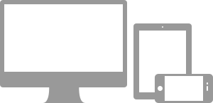
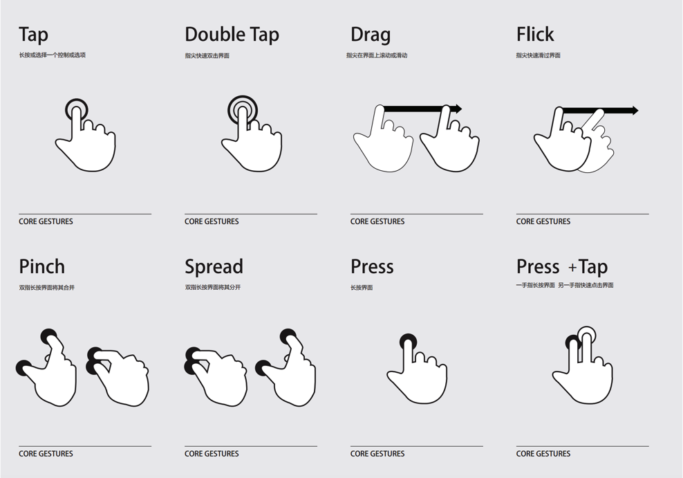
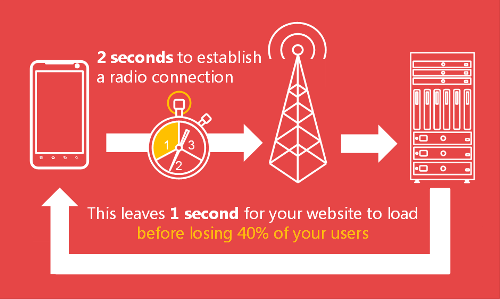
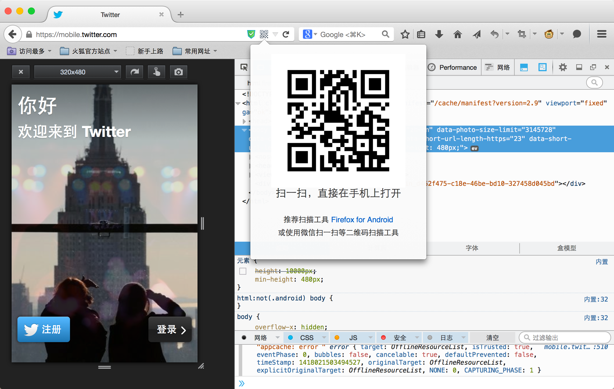
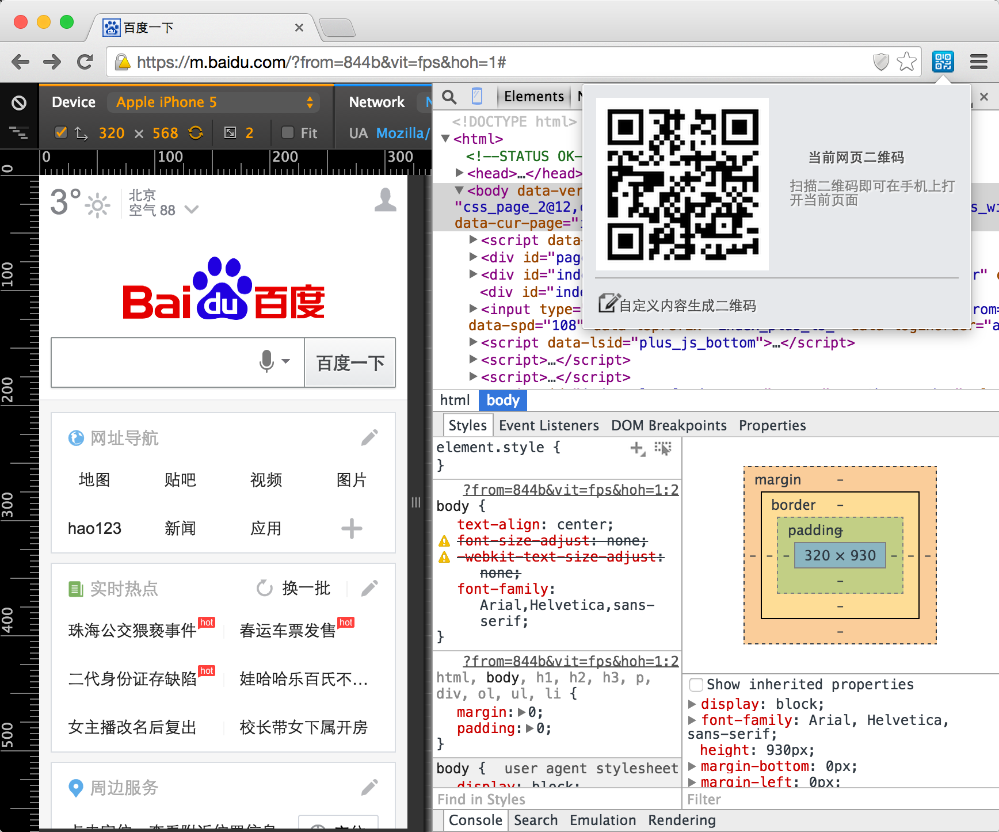
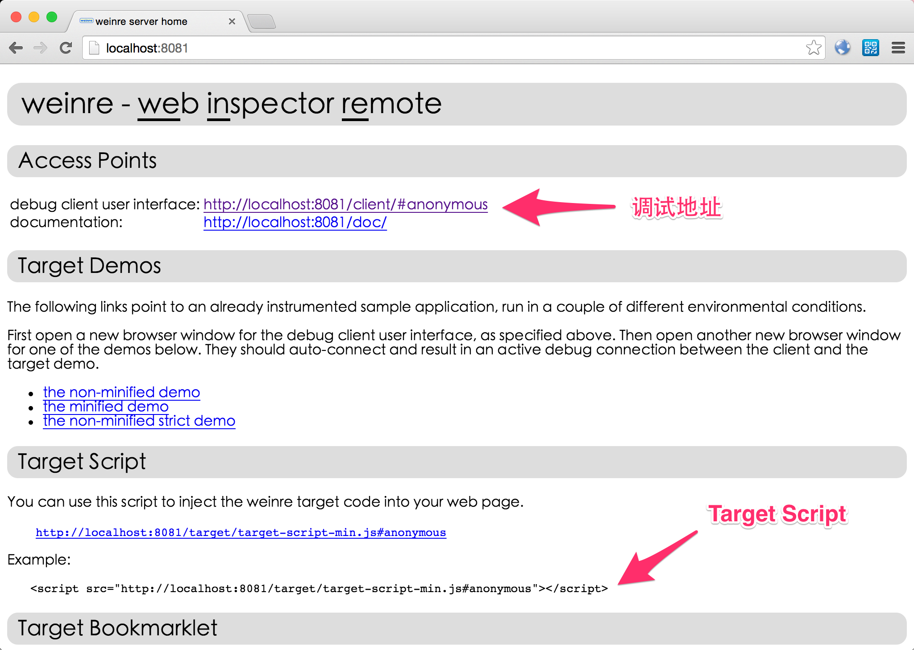

# 移动web开发入门

---

# 目标

* 建立基本的移动web开发知识体系
* 常见问题的实践

---

# 内容

* 基本概念
* 视觉
* 交互
* 实践
* 调试

---

# 基本概念

----

### native

> 本地应用
> 使用 `Java` \ `Objective-C` \ `Swift` 开发


----

### webapp

> 网页应用
> `html5` 开发

----

### hybrid

> 混合应用
> ooxx(native, web)

----

### 对比

|                  | Web App          | Hybrid App | Native App  |
|:---------------- |:----------------:|:----------:|:-----------:|
| 开发成本         | 低               | 中         | 高          |
| 维护更新         | 简单             | 简单       | 复杂        |
| 体验             | 差               | 中         | 优          |
| Store/market认可 | 不认可（轻应用?）| 认可       | 认可        |
| 安装             | 不需要           | 需要       | 需要        |
| 跨平台           | 优               | 优         | 差          |

---

# 视觉

----

### devicePiexelRatio

> `pixel` - px ( picture element )

> `dpi` / `ppi` - 每英寸像素 ( dot per inch )

> `dips` - 设备独立像素 ( device-independent pixels )

> `devicePixelRatio` - 物理像素 / dips

----


----

### 文字 px, rem

> 固定大小 - px

> 多屏适配，统一修改 - rem

> rem - font size of the root element [(W3C)](http://www.w3.org/TR/css3-values/#rem-unit)

> Q: why not em? A: r

----

### viewport

```
<meta name="viewport"
      content="width=device-width,
               height=device-height,
               inital-scale=1.0,
               maximum-scale=1.0,
               user-scalable=no;"
/>
```

> `width` - viewport的宽度

> `height` - viewport的高度

> `initial-scale` - 初始的缩放比例

> `maximum-scale` - 允许用户缩放到的最大比例

> `user-scalable` - 用户是否可以手动缩放

----

### 橫屏/竖屏

```
window.addEventListener('orientationchange', function() {
   // rerender something
});

console.log(window.orientation); // 0, 90, 180, -90 顺时针角度
```

```
<style media="all and (orientation:portrait)" type="text/css">
    /* 竖屏 */
</style>

<style media="all and (orientation:landscape)" type="text/css">
    /* 横屏 */
</style>
```

> [matchMedia](https://github.com/ecomfe/saber-matchmedia)

----

### flex 伸缩布局

```
.container {
  display: -webkit-flex;
  display: flex;
}
.initial {
  -webkit-flex: initial;
          flex: initial;
  width: 200px;
  min-width: 100px;
}
.none {
  -webkit-flex: none;
          flex: none;
  width: 200px;
}
.flex1 {
  -webkit-flex: 1;
          flex: 1;
}
.flex2 {
  -webkit-flex: 2;
          flex: 2;
}
```

----

demo

<style>
  .flex-demo {
  margin: 0;
  padding: 0 0 1em 0;
  font-size: 1em;
  line-height: 1.5em;
  color: #414142;
  font-family: Arial;
  background-color: #ededed;
}
.flex-demo * {
  -webkit-box-sizing: border-box;
  -moz-box-sizing: border-box;
  box-sizing: border-box;
}
.flex-demo .elem p {
  padding: 0 1em;
}
.flex-demo p {
  margin: 1em 0;
  font-size: 0.5em;
}
.flex-demo .elem-green > .label,
.flex-demo .elem-green > .endlabel {
  background-color: #FDC72F;
}
.flex-demo .label {
  top: 0;
  left: 0;
  padding: 0 3px 3px 0;
}
.flex-demo .label,
.flex-demo .endlabel {
  position: absolute;
  background-color: #6AC5AC;
  color: #414142;
  line-height: 1em;
  font-size: 0.5em;
}
.flex-demo .endlabel {
  right: 0;
  bottom: 0;
  padding: 3px 0 0 3px;
}
.flex-demo .elem {
  border: solid #6AC5AC 3px;
  position: relative;
}
.flex-demo .elem-green {
  border: solid #FDC72F 3px;
}
.flex-demo .container {
  display: -webkit-flex;
  display: flex;
}
.flex-demo .initial {
  -webkit-flex: initial;
  flex: initial;
  width: 200px;
  min-width: 100px;
}
.flex-demo .none {
  -webkit-flex: none;
  flex: none;
  width: 200px;
}
.flex-demo .flex1 {
  -webkit-flex: 1;
  flex: 1;
}
.flex-demo .flex2 {
  -webkit-flex: 2;
  flex: 2;
}

</style>
<div class="flex-demo">
<div class="container elem">
  <div class="elem elem-green initial">
    <span class="label">&lt;div class="initial"&gt;</span>
    <p>
      空间足够的时候，我的宽度是200px，如果空间不足，我会变窄到100px，但不会再窄了。
    </p>
    <span class="endlabel">&lt;/div&gt;</span>
  </div>

  <div class="elem elem-green none">
    <span class="label">&lt;div class="none"&gt;</span>
    <p>
      无论窗口如何变化，我的宽度一直是200px。
    </p>
    <span class="endlabel">&lt;/div&gt;</span>
  </div>

  <div class="elem elem-green flex1">
    <span class="label">&lt;div class="flex1"&gt;</span>
    <p>
      我会占满剩余宽度的1/3。
    </p>
    <span class="endlabel">&lt;/div&gt;</span>
  </div>

  <div class="elem elem-green flex2">
    <span class="label">&lt;div class="flex2"&gt;</span>
    <p>
      我会占满剩余宽度的2/3。
    </p>
    <span class="endlabel">&lt;/div&gt;</span>
  </div>
</div>
</div>


> [learn layout - flexbox](http://zh.learnlayout.com/flexbox.html)

----

主要历史版本

> [20090723 WD](http://www.w3.org/TR/2009/WD-css3-flexbox-20090723/) (display: box;)

> [20110322 WD](http://www.w3.org/TR/2011/WD-css3-flexbox-20110322/) (display: flexbox;)

> [20120918 CR](http://www.w3.org/TR/2012/CR-css3-flexbox-20120918/) (display: flex;)

```
.page-wrap {
  display: -webkit-box;      /* OLD - iOS 6-, Safari 3.1-6 */
  display: -moz-box;         /* OLD - Firefox 19- (buggy but mostly works) */
  display: -ms-flexbox;      /* TWEENER - IE 10 */
  display: -webkit-flex;     /* NEW - Chrome */
  display: flex;             /* NEW, Spec - Opera 12.1, Firefox 20+ */
 }
```

> [Using Flexbox: Mixing Old and New for the Best Browser Support](http://css-tricks.com/using-flexbox/)

----

### 响应式Web设计（Responsive Web Design）



> [Media Type](http://www.w3.org/TR/CSS2/media.html#media-types)

> [Media Query](http://www.w3.org/TR/css3-mediaqueries/)

> [Breakpoint](https://github.com/lolmaus/breakpoint-slicer)

----

### 软键盘

> 打开数字键盘

```
<input type="tel">
```

----

### 隐藏地址栏

```
setTimeout(function(){ window.scrollTo(0, 1); }, 0);
```

----

### apple-touch-icon

> 在iPhone,iPad,iTouch的safari上可以使用添加到主屏按钮将网站添加到主屏幕上

```
<link rel="apple-touch-icon" href="apple-touch-icon-iphone.png" />
<link rel="apple-touch-icon" sizes="72x72" href="apple-touch-icon-ipad.png" />
<link rel="apple-touch-icon" sizes="114x114" href="apple-touch-icon-iphone4.png" />
```

---

# 交互

----

### touch

> 摩擦、摩擦

----

### tap

> `click` 有 300&plusmn; ms 延迟

> 服用 [fastclick](https://github.com/ftlabs/fastclick) 后, 可以解决 `click` 的延迟, 还可以防止 `穿透`(跨页面穿透除外), 嘿嘿嘿

----

### scroll

> 区域滚动 `overflow:auto` 不靠谱

> [iscroll](http://iscrolljs.com/)

> [saber-scroll](https://github.com/ecomfe/saber-scroll)

----

### gestures



----

> [TouchGestureCards](http://static.lukew.com/TouchGestureCards.pdf) by [lukew](http://www.lukew.com/ff/entry.asp?1370)

> [hammer](http://hammerjs.github.io/). A javascript library for multi-touch gestures

----

### A

* block
> 食指点击目标尺寸是44 x 44像素，拇指是72 x72像素 [finger friendly design](http://www.smashingmagazine.com/2012/02/21/finger-friendly-design-ideal-mobile-touchscreen-target-sizes/)

* `tel:` / `sms:`

----

### HTML5 APIs [(W3C)](http://www.w3.org/2009/dap/)

* 刮一刮 (canvas)
* 摇一摇 (Device Orientation API)
* 咻咻咻 (audio)
* 啪啪啪 (getUserMedia)

---

# 实践

----

### -webkit-tap-highlight-color: rgba(255,255,255,0)

> 可以屏蔽点击元素时出现的阴影, 常用于有事件代理的父元素

----

### IMG

* @2x, @3x
> 感谢`apple`一次又次一次 重新发明像素

* font icon
> 矢量图标, 自由变化大小, 颜色;
> 妈妈再也不用担心我的切图

----

### IMG

* base64
> 减少一个请求, 首屏图片无延迟;
> 图片没法gzip，而css可以

* lazyload
> 有流量就会放肆，没流量就会克制

----

### css3

* 合理使用渐变/圆角/阴影
> 别太多, 低端机 hold 不住

* 代替js动画
> 性能好, 兼容好, why not?

* translate3d
> 开启GPU硬件加速, 提升动画渲染性能

* backface-visibility: hidden
> 解决动画闪烁问题

----

### localStorage

* tpl
* data
* js
* img

> 每个域的最大长度为5MB

----

### 避免

* iframe
> 卡 cry, viewport 失效, iOS 宽高失效, fixed定位错误

* fixed + input
> 什么仇什么怨

> 移动商桥 ios/android 分版本 hack

----

### SPA or Multi Page

|          | Multi Page (AJAX) | SPA        | Isomorphic |
|:---------|:-----------------:|:----------:|:----------:|
| 模板     | 1+                | 1          | 1          |
| 首屏数据 | 同步              | 异步       | both       |
| 渲染     | both              | client     | both       |
| 转场     | 差                | 优         | 优         |
| SEO      | 优                | 差         | 优         |
| 路由     | 多个              | 多个       | 一致       |

----

### can i use

| feature      | can i use                     |
| ------------ | ----------------------------- |
| es5          | 那些年，每个库都有一个 `each` |
| JSON parsing | 别了, `JSON2`                 |
| localstorage | 存、存、存，有存，任性        |
| canvas       | 和 `Echarts` 愉快的玩耍       |
| GeoLocation  | 周围有啥好吃的                |

> [caniuse.com](http://caniuse.com/)

----

### 压缩合并 gzip 14k

> 初始拥塞窗口数 initcwnd = 10

> 最大传输单元 MTU = 1500Bytes

> 首次传输大小 10 * 1500 ~ 14.5Kb

> 返回头 Response Header ~ 0.5Kb

> 内容 Body ~ 14Kb

----

### 2G/3G 下建立连接时间




> [Creating High-Performance Mobile Websites](http://www.smashingmagazine.com/2013/08/12/creating-high-performance-mobile-websites/)

---

# 调试

----

### 二维码



----

* [firefox aurora](https://www.mozilla.org/zh-CN/firefox/channel/#aurora)

* [chrome 扩展](https://chrome.google.com/webstore/detail/uc-qr-code/nhelohnehpahakjoklmodmogclacjgdj)

----

### chrome



----

### Remote Debugging with Chrome for Android(4.4+)

> <chrome://inspect/#devices>

----

### IOS (6.0.1+) + OS X (Mountain Lion+)  + Safari

`IOS端`:
> 设置 → Safari → 高级 → Web 检查器 → 开

`OS X`:
> Safari → 偏好设置 → 高级 → 在菜单栏中显示`开发`菜单

> Safari → 开发 → XXX's Phone  → xxx.com

----

### weinre


----

> npm 安装

```
npm install -g weinre
```

----

> 启动 weinre 服务

```
weinre --boundHost -all- --httpPort 8081
```

----

> 打开 weinre 服务页面 `http://localhost:8081`



----

> 在需要调试页面嵌入 `target script`, 注意 `localhost` 要替换成手机可访问的 `IP`, 打开调试地址, 启动开发者工具, 开始调试吧

----


----

> [Weinre Doc](http://people.apache.org/~pmuellr/weinre/docs/latest/)

----

### edp

完成楼上的事情

```
edpm start
```

---

# efe mobile

[](http://ecomfe.github.io/saber/)

---

# thx
